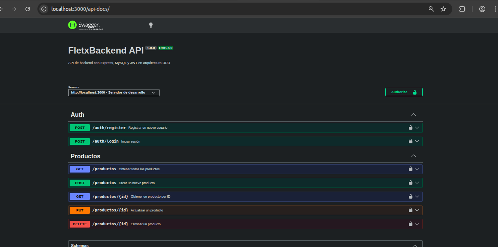

# PruebaFLETX
En este repositorio puede encontrar una prueba completa de Login y CRUD

1. Crea un frontend en Angular y un backend en Node.js (puedes usar Express o NestJS) con conexión a MySQL. Implementa un formulario de login y registro utilizando JWT.
2. Una vez logueado, implementa un CRUD protegido (validando el token) para una entidad simple. El uso de CSS para los formularios es opcional.
3. Crea servicios para las consultas en carpetas separadas (ej. services/usuario.service.ts) para una
mejor comprensión del código.
4. Crea 2 carpetas separadas: una para el Backend (Node.js) y otra para el Frontend (Angular).
5. Puedes usar librerías de autenticación con JWT (por ejemplo, jsonwebtoken, @nestjs/jwt, passport) o implementarlo desde cero

## Propuesta Backend

    

## Propuesta Frontend

    

